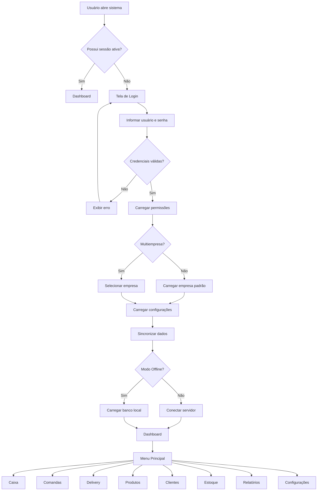
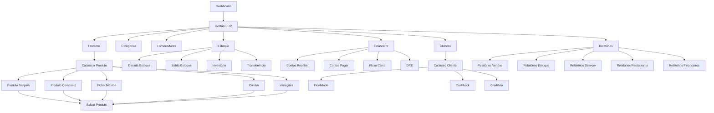
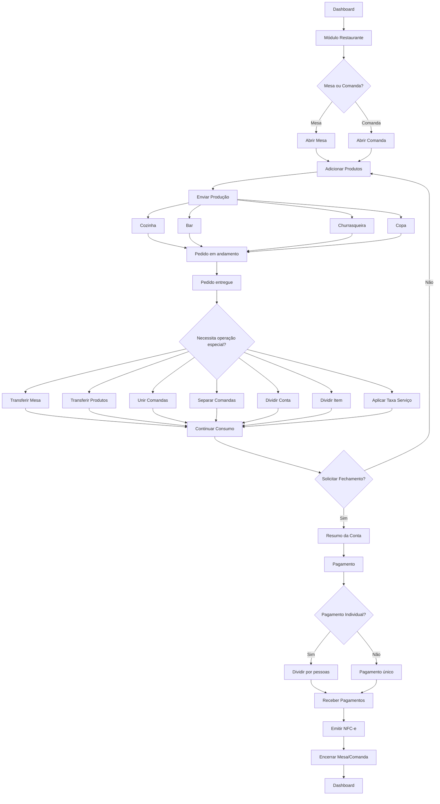
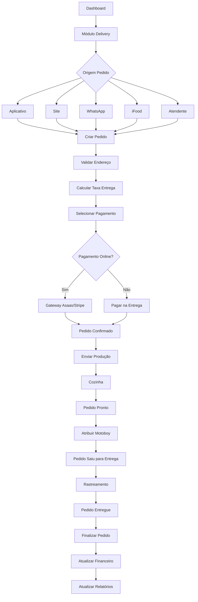
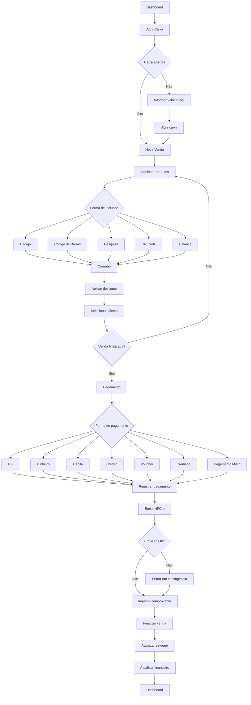
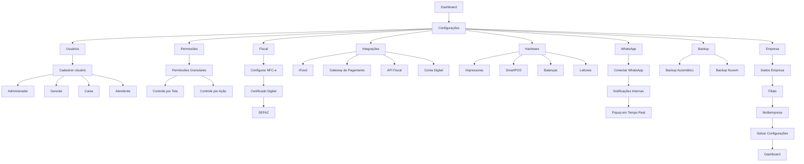

# Identity

## O que este projeto é
Plataforma SaaS ERP e PDV multiplataforma (Web, Desktop, Mobile, Totem, SmartPOS) e multiempresa, voltada para food service, varejo e eventos. O sistema atua como Single App, renderizando interfaces baseadas no perfil e permissões do usuário, suportando operações whitelabel e offline-first.

## O que este projeto não é
Não é um conjunto de aplicativos separados para cada função. Não é um sistema engessado esteticamente (deve suportar whitelabel por cliente). Não é um sistema unicamente cloud-dependent (deve suportar operações de PDV offline de forma resiliente).

## Por que existe
Para centralizar toda a operação comercial, fiscal, de delivery, salão e pagamentos de um estabelecimento em um único ecossistema soberano, ágil e customizável.

## Usuários primários
- Administradores (Painel Master / SaaS)
- Gerentes de loja
- Caixas (Operação de PDV)
- Atendentes / Garçons (Mobile/Comandas)
- Clientes Finais (Autoatendimento / Delivery / Totem)

## Critérios de sucesso
- Construção do esqueleto navegável (Fase 1 do Método FED) com Design System 100% aderente às regras de atomicidade e tokens.
- Operação offline-first no PDV demonstrável e funcional.
- Capacidade whitelabel totalmente funcional (troca de variáveis CSS modificando a interface sem hardcodes).
- Integração de todas as plataformas em um Single App de base única (Next.js/React).

## Fluxogramas do Sistema

### Fluxo de Acesso e Carregamento (Main Flow)

### Gestão ERP

### Módulo Restaurante (Mesas/Comandas)

### Módulo Delivery

### Módulo Caixa / PDV Checkout

### Configurações do Sistema

## Metadados
- Criado em: 2026-06-23
- Última revisão: 2026-06-25
- Status: ATIVO
