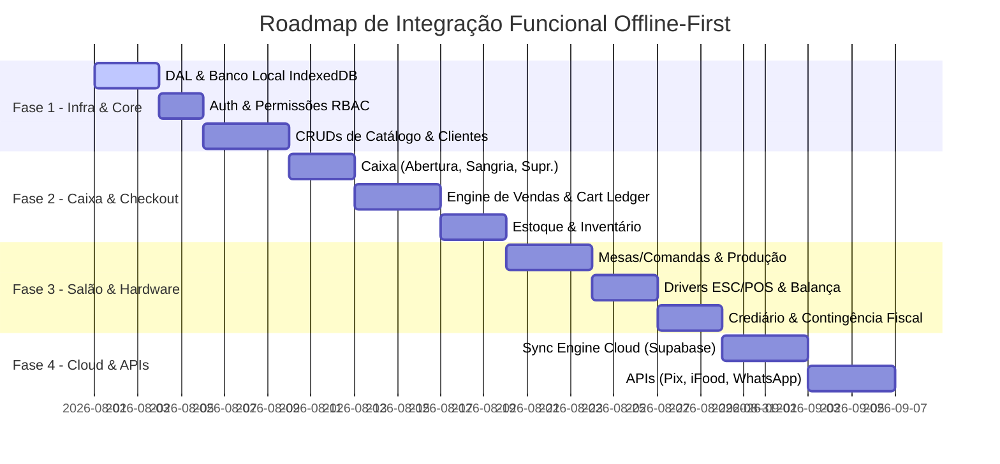

# Plano Arquitetural de Integração Funcional Backend Offline-First — Navelo PDV/SaaS

> **Documento de Especificação Técnica e Roadmap de Desenvolvimento**  
> **Projeto:** Navelo PDV & SaaS  
> **Status:** Aprovado para Fase de Integração Funcional  
> **Arquitetura Alvo:** Offline-First Soberano com Sincronização Híbrida Cloud (Local-First Architecture)

---

## 1. Visão Geral e Filosofia Offline-First

O **Navelo** é uma plataforma comercial multi-interface (PDV Balcão, Mesas/Comandas, Delivery, Autoatendimento, Mobile/SmartPOS). A premissa fundamental do sistema é a **soberania operacional offline**: o estabelecimento comercial **nunca pode parar de vender**, emitir comprovantes, controlar estoque ou registrar recebimentos devido à perda de conexão com a internet.

### 1.1 Camada de Abstração de Dados (DAL — Data Abstraction Layer)

Toda a leitura e escrita de dados pelas telas e componentes React da aplicação ocorrerá **exclusivamente através da DAL local**, localizada em `src/lib/dal`. Nenhum componente de UI chamará diretamente APIs externas ou SDKs de nuvem durante operações de rotina.

```
┌─────────────────────────────────────────────────────────────────────────────┐
│                          INTERFACES DE UI (React)                            │
│   [PDV Balcão]  [Mesas/Comandas]  [Produtos/CRUD]  [Configurações]  [Delivery]  │
└──────────────────────────────────────┬──────────────────────────────────────┘
                                       │
                                       ▼
┌─────────────────────────────────────────────────────────────────────────────┐
│                     CAMADA DE ABSTRAÇÃO DE DADOS (DAL)                      │
│     Repositórios Tipados (ProductRepository, SaleRepository, etc.)          │
└──────────────────────────────────────┬──────────────────────────────────────┘
                                       │
                    ┌──────────────────┴──────────────────┐
                    ▼                                     ▼
┌───────────────────────────────────────┐ ┌───────────────────────────────────┐
│     BANCO DE DADOS LOCAL (Primary)    │ │   FILA DE OUTBOX (Sync Queue)     │
│   IndexedDB (Dexie.js / Wa-Sqlite)    │ │ Write-Ahead Log (WAL) com UUIDs  │
└───────────────────────────────────────┘ └─────────────────┬─────────────────┘
                                                            │
                                                            ▼ (Background Worker)
                                          ┌───────────────────────────────────┐
                                          │      ENGINE DE SINCRONIZAÇÃO      │
                                          │  Sincronização Híbrida / Cloud    │
                                          └─────────────────┬─────────────────┘
                                                            │
                                                            ▼
                                          ┌───────────────────────────────────┐
                                          │     NUVEM (Supabase / Postgres)   │
                                          └───────────────────────────────────┘
```

### 1.2 Estratégia de Sincronização e Resolução de Conflitos
- **Operações Transacionais (Vendas, Caixas, Movimentações de Estoque, Lançamentos Financeiros):**  
  Adotam a estratégia **Event Sourcing / Append-Only**. Cada venda gera um evento imutável com UUID v4 gerado no cliente. Não existem conflitos de sobrescrita; os registros em nuvem são simplesmente inseridos sequencialmente.
- **Cadastros Mestre (Produtos, Categorias, Preços, Clientes, Configurações):**  
  Adotam a estratégia **Last-Write-Wins (LWW) com Hashing e Vector Clocks (`updated_at` + `device_id`)**. Alterações feitas offline no cliente sincronizam com a nuvem assim que a conexão for restabelecida.

---

## 2. Mapeamento de Telas, Configurações e Motores Nativos

Analisando a estrutura completa de componentes (`54 páginas/seções` e `10 grupos de configurações`), os sistemas foram organizados em **9 Motores Nativos do App** (Locais/Offline) e **5 Integrações de APIs** (Cloud).

---

## 3. FASE 1 — Motores Nativos do App (Offline-First)

### 3.1 Motor 1: Autenticação, Sessão Local e Governança de Acesso (RBAC)
* **Arquivos Relacionados:** `LoginSection.tsx`, `UsuariosSection.tsx`, `RestricoesSection.tsx`, `AutorizacoesSection.tsx`
* **Funcionalidades Nativas a Criar/Validar:**
  1. **Cache Local de Credenciais:** Armazenamento seguro do hash das senhas e PINs dos usuários no banco local para autenticação instantânea sem internet.
  2. **Validação Granular de Permissões:** Verificação local de permissões para ações restritas no PDV (Descontos acima do limite, Sangria de caixa, Cancelamento de item/venda, Reabertura de turno).
  3. **Solicitação de PIN de Supervisor:** Modal nativo para interceptar ações bloqueadas e validar senha/PIN de gerente no local.
  4. **Log Local de Auditoria:** Registro de todas as tentativas de acesso e autorizações concedidas na tabela local `authorization_logs` para visualização em `AutorizacoesSection.tsx`.

---

### 3.2 Motor 2: Gestão de Catálogo & Cadastros Mestre (CRUDs Core)
* **Arquivos Relacionados:** `ProdutosSection.tsx`, `CatalogoProdutosSection.tsx`, `GruposSubgruposSection.tsx`, `UnidadesSection.tsx`, `FornecedoresSection.tsx`, `CidadesSection.tsx`, `ClientesSection.tsx`
* **Funcionalidades Nativas a Criar/Validar:**
  1. **CRUD Completo de Produtos:**
     - Cadastro de campos básicos: Nome, Código Interno, EAN-13, Preço de Custo, Preço de Venda, Unidade, Categoria/Grupo/Subgrupo, Fornecedor.
     - Cadastro Fiscal: NCM, CEST, Origem da Mercadoria, Alíquotas de ICMS, PIS e COFINS.
     - Modalidades Especiais: Produto Peso/Quilo, Produto Composto / Ficha Técnica (ingredientes), Variações/Tamanhos, Grupos de Adicionais/Complementos.
  2. **Indexador de Busca Ultra-rápido:** Criação de índices locais (`name_search_idx`, `barcode_idx`) no IndexedDB para busca em sub-10ms no caixa por nome, código ou EAN.
  3. **CRUD de Grupos e Subgrupos:** Árvore categórica de produtos para navegação em grade/grid no PDV e autoatendimento.
  4. **CRUD de Unidades de Medida:** Gestão de tokens como `UN`, `KG`, `CX`, `PCT`, `L`.
  5. **CRUD de Fornecedores e Cidades:** Registro de CNPJ/CPF, razão social, inscrição estadual, código IBGE de cidades e contatos.
  6. **CRUD de Clientes:** Cadastro de clientes com CPF/CNPJ, endereço completo de entrega, limite de crediário (fiado) e histórico de compras.

---

### 3.3 Motor 3: Controle de Caixa & Operações de Turno (Caixa Ledger)
* **Arquivos Relacionados:** `PdvSection.tsx`, `PdvSangriaModal.tsx`, `TotaisEmCaixaSection.tsx`, `ComprovantesSection.tsx`
* **Funcionalidades Nativas a Criar/Validar:**
  1. **Abertura de Caixa (Fundo de Troco):** Lançamento inicial de valor em dinheiro no início do turno, registrando `operator_id`, `opened_at` e `initial_balance`.
  2. **Sangria (Retiradas):** Registro de saídas de dinheiro do caixa com motivo, valor e solicitação de assinatura/PIN de gerência.
  3. **Suprimento (Aportes):** Registro de entradas adicionais de troco no caixa.
  4. **Fechamento Cego de Caixa:** Interface para o operador declarar os valores em espécie, cartão e comprovantes sem ver o saldo esperado pelo sistema.
  5. **Conferência e Relatório de Caixa:** Geração do resumo de movimentação por forma de pagamento (`TotaisEmCaixaSection.tsx`) e impressão do comprovante de fechamento de caixa na impressora térmica.

---

### 3.4 Motor 4: Engine de Vendas & Processamento de Checkout (PDV Core)
* **Arquivos Relacionados:** `PdvSection.tsx`, `PdvCartDrawer.tsx`, `DiscountModal.tsx`, `PdvObservacaoModal.tsx`, `ChangeCalculatorModal.tsx`, `VendasSection.tsx`, `DevolucaoSection.tsx`
* **Funcionalidades Nativas a Criar/Validar:**
  1. **Gerenciador de Estado do Carrinho (Cart Ledger):** Adição, remoção, alteração de quantidade e adição de observações aos itens.
  2. **Calculadora de Descontos:** Aplicação de descontos por item ou no subtotal da venda (em R$ ou %).
  3. **Processamento de Pagamento Misto (Split Payment):** Divisão do pagamento de uma única venda em múltiplas formas (ex: R$ 50,00 em Dinheiro + R$ 30,00 no Pix + R$ 20,00 no Cartão de Débito).
  4. **Calculadora Automática de Troco:** Cálculo instantâneo do troco ao receber pagamento em dinheiro.
  5. **Finalizador de Venda:** Persistência atômica da venda no banco local (`sales` e `sale_items`), atualização automática do saldo de estoque e emissão da impressão do cupom.
  6. **Devolução e Cancelamento:** Fluxo de estorno de itens/vendas com devolução automática do saldo ao estoque e registro do motivo.

---

### 3.5 Motor 5: Controle de Estoque & Balanço (Stock Engine)
* **Arquivos Relacionados:** `EstoqueSection.tsx`, `NotaFiscalSection.tsx`
* **Funcionalidades Nativas a Criar/Validar:**
  1. **Baixa Automática no Ponto de Venda:** Abstração local que deduz o estoque dos produtos simples e dos insumos/ingredientes de produtos compostos no exato momento do fechamento da venda.
  2. **Ajuste Manual e Movimentações de Entrada/Saída:** Interface para correções de perdas, quebras, avarias e doações.
  3. **Balanço / Inventário de Estoque:** Contagem física de estoque com comparação entre saldo do sistema e saldo contado, gerando relatório de divergências.
  4. **Leitor de XML de NFe de Fornecedor:** Parser nativo no navegador que lê arquivos XML de NF-e, mapeia os produtos do fornecedor para os produtos locais e realiza a entrada automática de estoque.

---

### 3.6 Motor 6: Crediário & Contas a Receber (Fiado Engine)
* **Arquivos Relacionados:** `ContasAReceberSection.tsx`, `CrediarioSection.tsx`
* **Funcionalidades Nativas a Criar/Validar:**
  1. **Venda na Conta do Cliente (Fiado):** Validação do limite de crédito do cliente antes de permitir a finalização da venda na opção "Crediário".
  2. **Livro Razão de Títulos a Receber:** Lançamento de títulos com data de vencimento e número de parcelas.
  3. **Cálculo de Juros, Multa e Carência:** Motor local que aplica regras de atualização financeira sobre títulos em atraso de acordo com as configurações em `CrediarioSection.tsx`.
  4. **Baixa Parcial / Total de Títulos:** Recebimento de valores diretamente no caixa, atualizando o saldo devedor do cliente e gerando recibo/carnê de quitação.

---

### 3.7 Motor 7: Salão, Mesas e Comandas (Restaurante Engine)
* **Arquivos Relacionados:** `MesasComandasSection.tsx`, `ComandasSection.tsx`, `CreateComandaModal.tsx`, `ConfigurarComandasSection.tsx`, `TaxaServicoSection.tsx`
* **Funcionalidades Nativas a Criar/Validar:**
  1. **Máquina de Estados de Mesas/Comandas:** Gestão local dos estados (`Livre`, `Ocupada`, `Conta Solicitada`, `Encerrada`).
  2. **Lançamento de Pedidos e Roteamento de Produção:** Adição de itens a mesas/comandas com envio automático do pedido para a impressora do setor responsável (Cozinha, Bar, Copa).
  3. **Transferência de Produtos e Unificação de Comandas:** Transferência de itens entre mesas, transferência integral de mesa e fusão de duas ou mais comandas.
  4. **Divisão de Conta e Taxa de Serviço:** Divisão automática do valor total pelo número de pessoas na mesa e aplicação/remoção da taxa de serviço (10%).

---

### 3.8 Motor 8: Periféricos & Hardware Local (Web Drivers Engine)
* **Arquivos Relacionados:** `ImpressoraSection.tsx`, `PontosImpressaoSection.tsx`, `BalancaCheckoutSection.tsx`, `BalancaEtiquetadoraSection.tsx`, `PrintTestModal.tsx`, `ScaleStatusModal.tsx`
* **Funcionalidades Nativas a Criar/Validar:**
  1. **Driver ESC/POS Térmico Direto (WebUSB / WebSerial):** Impressão direta em impressoras térmicas (80mm e 58mm) sem abrir a janela de diálogo do navegador.
  2. **Driver de Comunicação com Balanças de Checkout (WebSerial):** Leitura contínua da porta serial (RS232) para captação automática do peso enviado por balanças Toledo, Filizola e Urano.
  3. **Parser de Código de Barras EAN-13 de Balanças Etiquetadoras:** Decodificação automática de etiquetas pesadas que iniciam com o dígito `2` (ex: `20RRRRREEEEEV` ou `21RRRRRPPPPPV`), extraindo o código do produto e o peso/valor gravados na etiqueta.
  4. **Acionamento de Gaveta de Dinheiro:** Envio de pulso elétrico `ESC/POS` (`0x1B 0x70`) para abertura da gaveta conectada via cabo RJ12 na impressora.

---

### 3.9 Motor 9: Contingência Fiscal NFC-e & Backup Local
* **Arquivos Relacionados:** `NotaFiscalSection.tsx`, `BackupSection.tsx`, `BackupSuccessModal.tsx`
* **Funcionalidades Nativas a Criar/Validar:**
  1. **Gerador de Payloads NFC-e em Modo Contingência Offline:** Montagem da estrutura XML da NFC-e no cliente, assinada e numerada sequencialmente pelo contador local.
  2. **Fila Local de Transmissão SEFAZ:** Armazenamento das notas emitidas em contingência em tabela local `contingency_notes` para envio em lote assim que a conexão retornar.
  3. **Impressão de DANFE NFC-e Simplificado:** Layout de impressão em bobina térmica do comprovante fiscal contendo a chave de acesso de 44 dígitos e o QR Code de contingência.
  4. **Backup e Restauração de Dados Locais:** Exportação do arquivo completo do banco de dados local (`.json` ou `.sqlite`) e restauração via modal em `BackupSection.tsx`.

---

## 4. FASE 2 — Integrações de APIs & Serviços Cloud

Após a consolidação de todos os 9 Motores Nativos Locais, passaremos à integração dos serviços em nuvem:

### 4.1 Sincronização Cloud (Supabase PostgreSQL & Realtime)
- Conexão da DAL com a API GraphQL/REST do Supabase.
- Sincronização em background via Service Worker / Web Worker.
- WebSocket para atualização em tempo real do KDS (Monitor de Cozinha) e status de mesas entre múltiplos terminais.

### 4.2 Gateway de Pagamentos & Pix Dinâmico
* **Arquivos Relacionados:** `PixSection.tsx`, `PagamentoIntegradoSection.tsx`, `ContaDigitalSection.tsx`
- Integração com Mercado Pago / Asaas para geração de QR Code Pix dinâmico com confirmação de pagamento instantânea via Webhook/Polling.
- Integração com SmartPOS / TEF para envio do valor diretamente à maquininha de cartão.

### 4.3 Delivery & iFood Integration
* **Arquivos Relacionados:** `IFoodSection.tsx`, `DeliverySection.tsx`, `CatalogoOnlineSection.tsx`
- Polling/Webhooks com a API oficial do iFood (Merchant API) para recepção automática de pedidos no painel de Delivery.
- Sincronização bidirecional de cardápio e status de loja (Aberta/Fechada).

### 4.4 WhatsApp Notification Bot
* **Arquivos Relacionados:** `WhatsAppSection.tsx`
- Integração com API WhatsApp (Z-API / Baileys / Evolution API) para envio automatizado de comprovantes de venda e notificações de status de entrega ("Seu pedido saiu para entrega!").

---

## 5. Roadmap de Implementação Sequencial (Plano de Execução)

Para garantir máxima estabilidade e zero regressão no projeto, a implementação será realizada nas seguintes etapas:



---

## 6. Mapeamento de Gaps das Telas de Configurações (`ConfiguracoesSection.tsx`)

Com base no levantamento minucioso dos 10 grupos de módulos presentes no painel de configurações, catalogamos o estado de integração offline-first e os gaps a serem supridos:

| Grupo de Configurações | Sub-tela / Módulo | Estado Atual | Ação / Requisito Offline-First |
|---|---|---|---|
| **1. Empresa & Sincronização** | `dados-empresa` | Persistido no IndexedDB (`db.companies`) | Integrado e sincronizado via `sync_queue`. |
| | `sincronizacao` | UI com toggle switch | Adicionar monitor visual de itens pendentes de envio e gatilho "Sincronizar Agora". |
| **2. Usuários & Acesso** | `usuarios` | Seeding dinâmico no IndexedDB (`db.users`) | Conectar formulário de criação/edição de operadores (Gerentes, Caixas, Atendentes, Totens) ao IndexedDB/Supabase. |
| | `restricoes` | UI de permissões RBAC | Armazenar tabela de permissões por perfil (`role_permissions`) no IndexedDB. |
| | `autorizacoes` | UI de logs | Registrar tentativas de liberação restrita no IndexedDB (`db.audit_logs`). |
| **3. Nota Fiscal** | `nota-fiscal-config` | UI com parâmetros de NFC-e / NF-e | Implementar fila local de emissão em contingência (`db.contingency_notes`) quando desmesurado da internet. |
| **4. Pagamentos & Crediário** | `pagamento-integrado` & `ordem-pagamento` | Integração POS | Enfileirar transações TEF/SmartPOS locais e conciliar via sync engine. |
| | `conta-digital` & `pix` | Configuração Asaas / Mercado Pago | Suportar geração local offline de chave Pix estática / webhook online. |
| | `crediario` | UI com parâmetros de juros/carência | Conectar motor de concessão de crédito ao saldo do cliente no IndexedDB (`db.customers`). |
| **5. Delivery & Catálogo** | `catalogo-online` & `entregadores` | UI de entregadores | Armazenar cadastro de entregadores em `db.riders` para atribuição offline. |
| | `ifood` | Integração API iFood | Receber webhooks online e injetar pedidos diretamente em `db.orders`. |
| | `taxa-entrega` | UI de taxas por bairro/CEP | Salvar tabela de fretes locais no IndexedDB (`db.delivery_rates`). |
| **6. Consulta, Balança & Mesas** | `consulta-preco` | App externo | Leitura rápida de EAN-13 via consulta direta ao IndexedDB `db.products`. |
| | `pesagem-automatica` | App balança restaurante | Integração com peso via protocolo serial. |
| | `menu-digital` & `mesas-comandas` | Gestão de comandas | Persistir estado de mesas e comandas consumidas em `db.tables` e `db.tabs`. |
| | `autoatendimento` | Layout do Totem | Respeitar perfil `TOTEM` e travar aplicação em modo Kiosk. |
| **7. Cadastros Básicos** | `grupos-subgrupos` | Persistido no IndexedDB (`db.categories`) | Totalmente integrado com IndexedDB. |
| | `unidades` | UI de unidades (UN, KG, CX) | Adicionar tabela `db.units` no IndexedDB para unidades de medida personalizadas. |
| | `fornecedores` | UI de cadastro | Criar tabela `db.suppliers` no IndexedDB e conectar ao formulário de fornecedores. |
| | `cidades` | Tabela IBGE | Armazenar tabela de municípios locais em `db.cities`. |
| **8. Impressora & Comprovantes** | `impressora` & `pontos-impressao` | UI de impressoras | Integrar driver ESC/POS via Web USB/Serial para impressão direta no caixa e cozinha. |
| | `comprovantes` | Customização de tickets | Renderizar e emitir recibos alimentados pelos dados da venda em `db.sales`. |
| **9. Balanças** | `balanca-checkout` | Protocolos Filizola / Toledo | Parser serial via Web Serial API. |
| | `balanca-etiquetadora` | Parser EAN-13 | Parser de código de barras iniciado em `2000000000000` extraindo preço/peso no checkout. |
| **10. Backup & Restauração** | `backup-config` | UI de exportação | Criar rotina de dump JSON do Dexie (`exportToJson`) e restauração offline (`importFromJson`). |

---

## 7. Próximo Passo Imediato

1. **Construção da DAL Completa (`src/lib/dal/index.ts` & `localDb.ts`):** Ampliação dos repositórios nativos e tabelas locais no Dexie IndexedDB.
2. **Integração do Formulário de Usuários (`UsuariosSection.tsx`):** Permitir que o Administrador adicione novos operadores (Gerente, Caixa, Atendente, Totem) salvas no IndexedDB.

---
*Plano arquitetural atualizado com a análise completa de gaps.*

